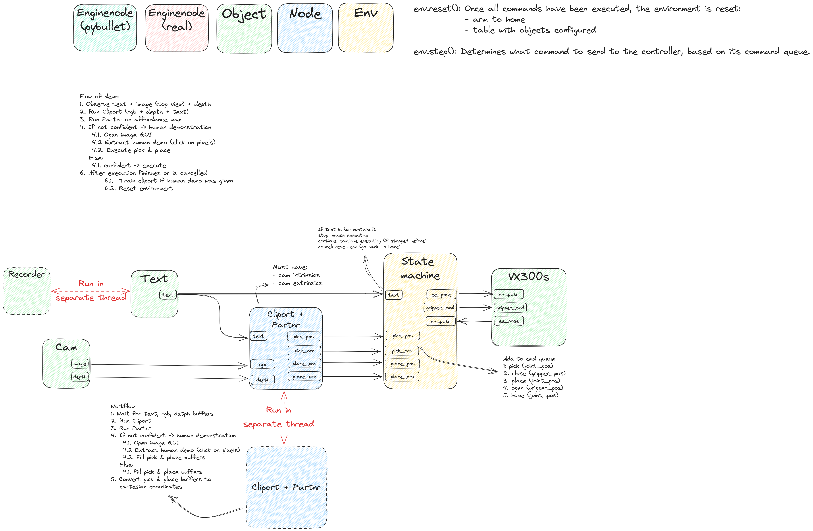

# `eagerx_demo` package

[](https://opensource.org/licenses/Apache-2.0)
[](https://github.com/psf/black)
[](https://github.com/eager-dev/eagerx_demo/actions/workflows/ci.yml)
[](https://github.com/eager-dev/eagerx_demo/actions/workflows/ci.yml)


What is the `eagerx_demo` package
-------------------------------------

This repository contains the code for an interactive imitation learning demo using EAGERx.
Specifically, it allows to train a [CLIPort](https://cliport.github.io/) model interactively using [PARTNR](https://partnr-learn.github.io/).

[The core repository is available here.](https://github.com/eager-dev/eagerx)
[Full documentation and tutorials (including package creation and contributing) are available here.](https://eagerx.readthedocs.io/en/master/)

Installation
------------

You can run the main code as follows:

*Prerequisites:* Install [Poetry](https://python-poetry.org/docs/master/#installation) and [ROS](http://wiki.ros.org/noetic/Installation).
For running the code with the real robot, the [interbotix_copilot](https://github.com/bheijden/interbotix_copilot) package is required.


```bash
    git clone git@github.com:eager-dev/eagerx_demo.git
    cd eagerx_demo
    poetry install
    python scripts/main.py
```

Demo Overview
-------------




Cite EAGERx
-----------

If you are using EAGERx for your scientific publications, please cite:

``` {.sourceCode .bibtex}
@article{eagerx,
    author  = {van der Heijden, Bas and Luijkx, Jelle, and Ferranti, Laura and Kober, Jens and Babuska, Robert},
    title = {EAGERx: Engine Agnostic Graph Environments for Robotics},
    year = {2022},
    publisher = {GitHub},
    journal = {GitHub repository},
    howpublished = {\url{https://github.com/eager-dev/eagerx}}
}
```

Acknowledgements
----------------

EAGERx is funded by the [OpenDR](https://opendr.eu/) Horizon 2020
project.